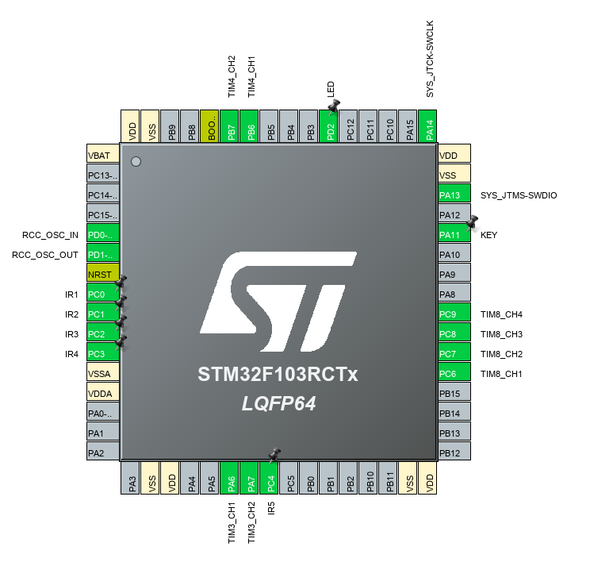

# maze_stm32_cubemx_clion
## 项目简介
利用stm32实现8*8迷宫小车。  
STM32CubeMX生成初始化代码。  
使用Clion编辑器进行编写。  
## 分支说明
traditional版本与51版本的编写思路相似，区别在于新增了编码电机的驱动、改变了红外避障的检测方式。  
## 片上资源分布  
+ SYSCLK：72MHz  
+ DEBUG：SWD  
+ TIM3：编码器模式  
+ TIM4：编码器模式  
+ TIM6：触发10ms中断  
+ TIM8：4通道PWM生成  
+ IIC2：OLED屏幕显示走迷宫进度  
+ USART1：串口调试  
  
## 软件设计
### 1、文件结构
+ main：主函数
+ infrared：红外驱动
+ maze：迷宫算法相关
+ motor：PI电机驱动
### 2、数据设计
+ carInfoType：小车自身信息结构体
````
typedef struct {
    char x; //坐标x
    char y; //坐标y
    char dir; //绝对方向
}carInfoType;
````
+ motorInfoType：电机自身信息结构体
````
typedef struct {
    int ENC;  //当前编码器示数
    int ADD;  //编码器累计示数
    int TGT;  //电机转速期望值
    int PWM;  //电机实际PWM赋值
}motorInfoType;
````
+ PI控制器相关变量
````
float Velocity_KP_A = 10,Velocity_KI_A = 10;
int Bias_A,Pwm_A,Last_bias_A;
float Velocity_KP_B = 10,Velocity_KI_B = 10;
int Bias_B,Pwm_B,Last_bias_B;
````
### 2、程序设计
#### 2.1、绝对方向与相对方向
````
/** 绝对方向：       相对方向：
  *     0           0：直行
  * 3       1       1：右转
  *     2           2：掉头
  *                 3：左转
**/
````
#### 2.2、主函数
+ 外设初始化
+ 外设启动
+ While1
    + 得出下一个绝对方向
        + 如果得不出，说明遍历结束，开始计算最优路径。
    + 执行这个方向
    + 刷新各项信息
        + 刷新地图路径信息
        + 刷新方向栈
        + 刷新小车自身信息
#### 2.3、10ms中断
+ 路线修正
    + 分别检测左右斜向红外避障模块，改变电机转速期望值来对路线进行修正。
+ 电机PI驱动  
    + 检测当前编码器示数
    + 对编码器示数进行累加
    + 左轮PI控制
    + 右轮PI控制
    + PWM限幅
    + PWM赋值
#### 2.4、最优路径BFS
~~//TODO~~

  